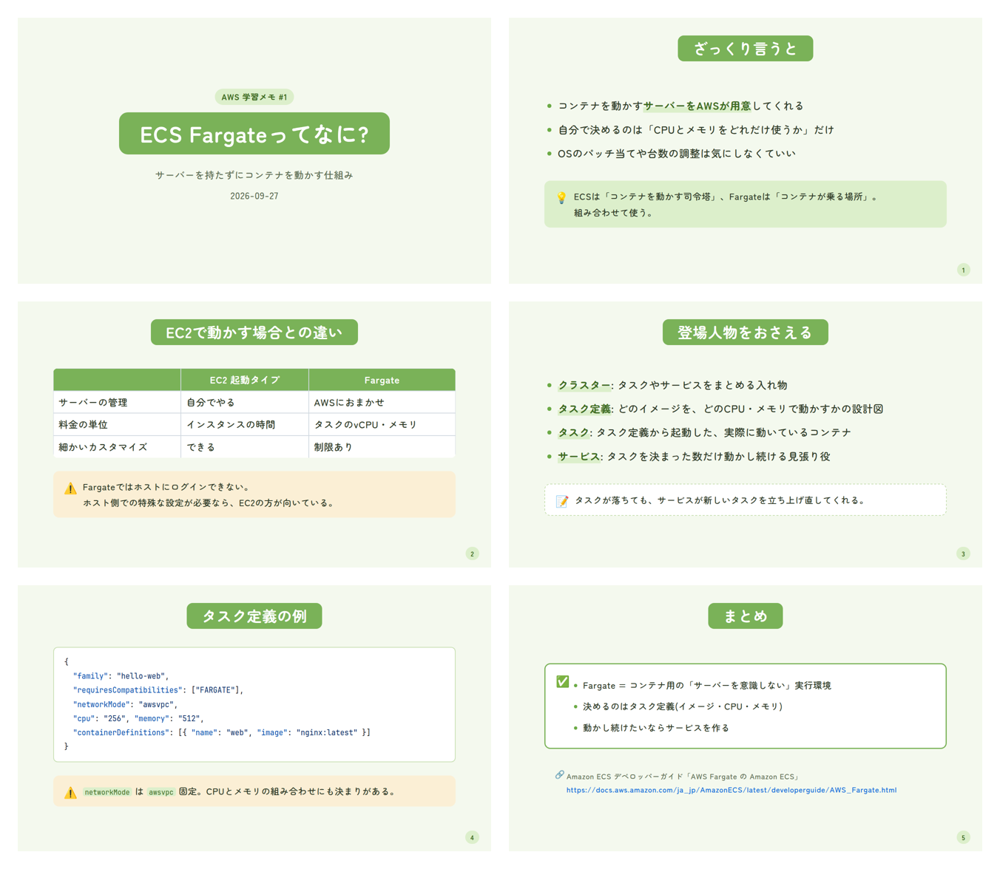

# slides-repo

Marpで作った学習・まとめ・講座スライドの置き場です。書いたスライドを自動で精査・レイアウト検査し、必要なときはPowerPointにも変換できるようにしています(開発中)。



## 構成

| パス | 内容 |
| --- | --- |
| `decks/{learning,summary,course}/` | 1デッキ=1フォルダ(`slides.md` + `images/`) |
| `archive/` | 完成済みの既存スライド(検査対象外) |
| `themes/wakaba.css` | 共通テーマ「若葉ライト」 |
| `tools/` | レイアウト検査・Jev精査などのツール |
| `powershell/` | PowerPoint COM補助スクリプト |
| `docs/requirements.md` | 要件定義書 |

## 使い方

```bash
npm install
npx marp --server decks     # ブラウザでプレビュー
npm run build               # dist/ にHTMLを一括出力
```

新しいデッキは `decks/<種別>/<YYYY-MM-slug>/slides.md` に、先頭へ `marp: true` と `theme: wakaba` を書いて作ります。
