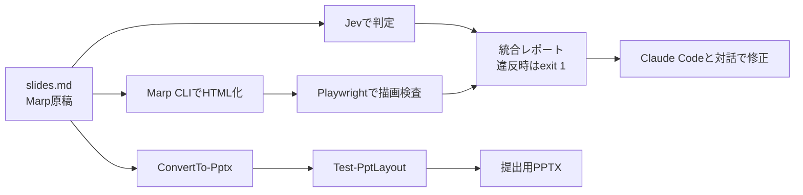

# スライド管理リポジトリ 要件定義書

Sep 27, 2026 · @ganeysa

## 目的・背景・スコープ

Marpで書いた学習・まとめ・講座スライドを1つのリポジトリに集約し、「書く → 精査 → レイアウト検査 → 出力」までを半自動化する。PowerPoint提出が必須の場面にも、PowerShell+COMで同じ原稿から対応できるようにする。

**背景**

- スライドが複数の場所に散らばっており、再利用・見直しがしづらい
- 内容の誤り・冗長さ、文字のはみ出しなどを人手で確認している
- 職場などでPowerPoint形式を求められる場面が一定数ある

**スコープ**

| 区分 | 含むもの | 含まないもの |
| --- | --- | --- |
| 管理 | Marp原稿・画像・テーマ・出力物の集約、メタデータ管理 | スライド共有サイトへの自動公開(将来検討) |
| 精査 | Jevによる判断(採点・検出・分類)、指摘スライドの原文付きレポート | 事実確認の完全自動化、LLM APIによる修正案の自動生成 |
| レイアウト | 描画結果を使ったはみ出し・密度・フォントサイズ検査 | デザインの美しさの自動評価 |
| PowerPoint | PowerShell+COMによる生成・変換・一括修正 | macOS版PowerPointの操作 |

職場のスライドはコンプライアンス上扱わない(スコープ外)。リポジトリは公開とし、置くのは個人の学習・まとめ・講座スライドのみ。

## 機能要件: スライド管理(Marp)

1デッキ=1フォルダで管理し、各デッキのfrontmatterに種別・タグ・状態を持たせて一覧と出力を自動化する。

| ID | 要件 | 優先度 |
| --- | --- | --- |
| M-01 | 1デッキ=1フォルダ(`slides.md`+`images/`)で管理する | Must |
| M-02 | frontmatterに `title` `category`(学習/まとめ/講座) `tags` `status`(draft/review/done) `created` `updated` を持つ | Must |
| M-03 | 雛形から新規デッキを作るコマンド(`new <slug> --category 講座`) | Must |
| M-04 | 共通テーマ(CSS)を `themes/` に置き、全デッキで共有する | Must |
| M-05 | HTML/PDF/PPTXを一括出力する(Marp CLI) | Must |
| M-06 | frontmatterから全デッキの一覧(README or 索引ページ)を自動生成する | Should |
| M-07 | 完成済みの既存スライドは archive/ にそのまま置き、精査・検査の対象外とする(索引とPages公開には含める) | Should |
| M-08 | GitHub PagesでHTML版を公開する | Could |
| M-09 | 講座スライド用に「発表者ノート」「演習ページ」の書き方を統一する | Could |

## 機能要件: Jevによる内容精査

Jevは全スライドの判定(採点・検出)を担い、引っかかったスライドは原文付きでレポートに載せる。修正はレポートを見ながらClaude Codeとの対話で行い、LLMのAPI(Claude API等)は使わない。JevはTypeSafe AIが2026年9月15日に早期提供を始めた判断専用モデルで、文章を生成せず、型付きの答えと確率・確信度だけを返すため。

**Jevの前提(2026年9月時点)**

- 質問の型は3つ: Choice(選択肢から1つ)、Score(段階評価)、Noul(記述が真である確率)
- 1リクエストは「State(判定対象)」+「Questions(複数可)」。同じStateに複数の質問をまとめて投げられる
- 上限は1リクエスト64kトークン(State+最長の質問で32k)
- 料金は入力100万トークンあたり0.042ドル、出力は無料。応答は70〜500ms
- 文章生成・計算・日付比較は不得意。修正文の作成は人(+Claude Codeとの対話)、数値チェックはコードが担当する

**判定する質問(案)**

| ID | 質問 | 型 | 対象(State) |
| --- | --- | --- | --- |
| J-01 | このスライドに技術的に誤っている可能性のある記述が含まれる | Noul | 1スライド |
| J-02 | 1枚に載せる情報量は適切か(少ない〜過多の5段階) | Score | 1スライド |
| J-03 | 見出しと本文の内容は一致しているか | Noul | 1スライド |
| J-04 | 対象読者に対して前提知識の説明は足りているか(5段階) | Score | 1スライド+デッキ概要 |
| J-05 | このスライドの役割(導入/説明/例/まとめ/演習) | Choice | 1スライド |
| J-06 | デッキ全体の流れは論理的につながっているか(5段階) | Score | 全スライドの見出し一覧 |
| J-07 | 社外秘・個人情報らしき記述が含まれる | Noul | 1スライド |

**処理要件**

| ID | 要件 | 優先度 |
| --- | --- | --- |
| R-01 | `slides.md` を `---` 区切りでスライド単位に分割し、State化する | Must |
| R-02 | 1スライドにつき質問をまとめて1リクエストで投げる | Must |
| R-03 | 確率・確信度に閾値を設け、超えたものだけ指摘として残す(閾値は設定ファイル) | Must |
| R-04 | 指摘ありのスライドはレポートに原文を載せ、Claude Codeとの対話で直せるようにする(LLM APIは使わない) | Should |
| R-05 | 結果をMarkdownレポート(スライド番号・質問・確率・該当スライドの原文)で出力する | Must |
| R-06 | 判定結果をキャッシュし、変更のあったスライドだけ再判定する | Should |
| R-07 | J-05の役割分類を使い「まとめが無い」「例が続きすぎ」等の構成チェックをコードで行う | Could |
| R-08 | APIキーは環境変数で渡し、リポジトリに含めない | Must |

## 機能要件: レイアウト自動チェック

Marp CLIで出力したHTMLをヘッドレスブラウザ(Playwright)で開き、実際の描画結果からはみ出しや詰め込みを機械的に検出する。原稿のMarkdownだけでは、テーマやフォントによる折り返しが分からないため。

| ID | チェック項目 | 判定方法 | 優先度 |
| --- | --- | --- | --- |
| L-01 | 文字・要素がスライド外にはみ出していない | 各 `section` の `scrollHeight > clientHeight`、要素の座標が枠外か | Must |
| L-02 | コードブロックが横にはみ出していない | `pre` の `scrollWidth > clientWidth` | Must |
| L-03 | フォントサイズが下限以上 | 計算後の `font-size` が設定値(例: 本文20px)未満の要素を検出 | Must |
| L-04 | 1枚の行数・文字数が上限以内 | 描画後のテキスト量をカウント(上限は設定ファイル) | Should |
| L-05 | 画像のリンク切れ・低解像度がない | `naturalWidth` と表示サイズの比 | Should |
| L-06 | 要素同士が重なっていない | 主要要素の矩形の交差判定 | Could |
| L-07 | 全スライドのサムネイル一覧(コンタクトシート)を出力する | スクリーンショットを1枚に並べる | Should |
| L-08 | 前回との見た目の差分を検出する | スクリーンショットの画像差分 | Could |

共通要件として、結果はJevの精査と同じレポートにスライド番号付きで統合し、Must項目の違反があれば終了コード1で終わる(CIで失敗させるため)。PowerPoint側の同等チェックはCOM版スクリプト(P-06)で行う。

## 機能要件: PowerPoint COM補助スクリプト(PowerShell)

Marp原稿から「文字を編集できる」PPTXを作る変換を中心に、PowerPoint作業をPowerShellモジュール(`PptHelper.psm1`)から操作できるようにする。Marp CLIのPPTX出力はスライドが画像になり、提出後に直せないことが多いため。

| ID | 機能(コマンド案) | 内容 | 優先度 |
| --- | --- | --- | --- |
| P-01 | `ConvertTo-Pptx` | Marp原稿を解析し、自作テンプレート(.potx)のレイアウトに見出し・箇条書き・画像・表・発表者ノートを流し込む | Must |
| P-02 | `Set-PptTemplate` | 既存PPTXにテンプレート(スライドマスター)を適用し直す | Should |
| P-03 | `Update-PptFont` | 全スライドのフォント名・サイズを一括置換する | Should |
| P-04 | `Export-Ppt` | PDF・スライドごとのPNGに書き出す | Must |
| P-05 | `ConvertFrom-Pptx` | 既存PPTXのテキストとノートをMarkdownに抜き出す(Jev精査・Marp移行用) | Should |
| P-06 | `Test-PptLayout` | 図形のスライド外はみ出し、テキストのあふれ、下限未満のフォントを検出する | Should |
| P-07 | `Merge-Ppt` | 複数のPPTXを1つに結合する | Could |

**実装上の要件**

- Windows+PowerPoint(デスクトップ版)がインストールされた環境でのみ動作する
- PowerShell 5.1と7の両方で動かす
- 処理後は `Quit()` と `[Runtime.InteropServices.Marshal]::ReleaseComObject()` で必ずCOMを解放し、PowerPointのプロセスを残さない(`try/finally`)
- 既存ファイルは上書きせず、別名で保存する(`-Force` 指定時のみ上書き)
- Marp→PPTXの対応表(`#`→タイトル、箇条書き→本文プレースホルダー、`<!-- -->`→ノート等)を設定ファイルで変更できる
- Pesterで単体テストを書く(COMを使う部分は手動テスト手順も用意する)

## リポジトリ構成案・技術スタック

検査・変換ツールはNode.js(TypeScript)で統一し、PowerPoint操作だけPowerShellに分ける。Marp CLIとPlaywrightがどちらもNode製で、同じ言語で書くと依存管理が1か所で済むため。



Jevの精査とレイアウト検査の結果は1つのレポートにまとまり、PPTX系統は提出が必要な時だけ走らせる。

```text
slides-repo/
├─ archive/          # 完成済みの既存スライド(検査対象外)
├─ decks/
│  ├─ learning/        # 学習用
│  ├─ summary/         # まとめ
│  └─ course/          # 講座
│     └─ 2026-09-aws-ecs/
│        ├─ slides.md
│        └─ images/
├─ themes/             # 共通Marpテーマ(CSS)
├─ templates/          # 新規デッキ雛形 / PowerPoint用 .potx
├─ tools/
│  ├─ review/          # Jev精査
│  ├─ layout/          # Playwrightレイアウト検査
│  └─ cli.ts           # new / build / check / index
├─ powershell/
│  ├─ PptHelper.psm1
│  └─ tests/           # Pester
├─ config/             # 閾値・質問定義・Marp→PPTX対応表
├─ reports/            # 生成レポート(git管理外)
├─ dist/               # 出力物(git管理外)
└─ .github/workflows/  # PR時に精査+検査を実行
```

| 領域 | 採用技術 |
| --- | --- |
| スライド | Marp CLI、Marp for VS Code |
| 精査 | Jev(Vercel AI Gateway経由、モデル名 typesafe-ai/jev、AI SDK 7)。修正はClaude Code(対話)で行い、LLM APIは使わない |
| レイアウト検査 | Playwright(Chromium)、pixelmatch(画像差分) |
| PowerPoint | PowerShell 5.1/7、PowerPoint COM、Pester |
| CI | GitHub Actions(PowerShell系はWindowsランナー) |

## 非機能要件・制約・リスク

最大のリスクはJevが公開から2週間の早期提供段階で、仕様・料金・制限が変わりうること。精査処理はJevの呼び出し部分を差し替え可能にしておく。

**非機能要件**

- 1デッキ(30枚想定)の精査+レイアウト検査が1分以内に終わる
- 精査のAPI費用はデッキ1回あたり数円以内に収める(Jevの入力課金のみ。LLM APIは使わない)
- 公開リポジトリのため、APIキーはリポジトリやログに残さない(ローカルは .env、CIはGitHub Secrets)
- コマンドはWindows/macOS両方で動く(PowerShell COM部分を除く)

**リスクと対策**

| リスク | 影響 | 対策 |
| --- | --- | --- |
| Jevの仕様・料金・制限の変更 | 精査が止まる | 呼び出しを1モジュールに閉じ込める。Jevが使えないときは精査だけ警告付きでスキップし、レイアウト検査は続ける |
| Jevの日本語・技術内容での判定精度が不明 | 誤検出・見逃し | 既存スライドで閾値を調整し、判定ログを残して見直す |
| 個人情報やAPIキーを公開リポジトリに載せてしまう | 情報漏えい | J-07の検出に加え、gitleaks等のシークレットスキャンをCIで実行する |
| COMでPowerPointのプロセスが残る | メモリ圧迫・ファイルロック | `try/finally` で解放、終了時にプロセス確認 |
| Marpの表現(CSS・HTML)がPPTXで再現できない | 見た目が崩れる | 変換対象の記法を限定し、非対応記法は警告を出す |

## スライドデザイン方針

共通テーマ(M-04)とレイアウト検査の閾値は、ここで決めた方針から作る。

| 項目 | 決定内容 |
| --- | --- |
| 画面比率 | 16:9(1280×720px) |
| 雰囲気・配色 | 若葉ライト(背景 #F4F9EE・文字 #2E3A27・アクセント #6BAA45)、ちょっと緩い雰囲気。見出しは中央寄せのラベル風(背景 #7AB258・白文字・角丸) |
| フォント・本文サイズ | Zen Maru Gothic(コードは UDEV Gothic)。見出し40px・本文28px・注釈20px。L-03の下限は20px |
| 1枚あたりの情報量 | 未決(L-04の上限になる) |
| 種別ごとの差 | 未決 |

吹き出しは5種類を絵文字付きで使い分ける: 💡ポイント、⚠️注意、📝補足、✅まとめ、🔗参考。原稿では div のクラス(point / warn / note / summary / ref)で書き、絵文字と色はテーマ側で付ける。

## 開発フェーズ・未決事項

まず既存スライドを集約して土台を作り、効果が見えやすいレイアウト検査→Jev精査→PowerPointの順に積み上げる。

| フェーズ | 内容 | 完了条件 |
| --- | --- | --- |
| 1. 土台 | フォルダ構成・共通テーマ・雛形・一括出力(M-01〜M-05) | 既存スライドを archive/ に集約し、1コマンドで全出力できる |
| 2. レイアウト検査 | L-01〜L-03、L-07、レポート出力、CI連携 | PR時にはみ出しが自動で検出される |
| 3. Jev精査 | R-01〜R-05、閾値調整 | 既存デッキ3本で誤検出が許容範囲に収まる |
| 4. PowerPoint補助 | P-01、P-04 → P-05、P-06 → 残り | 講座デッキ1本をテンプレート適用済みPPTXで提出できる |
| 5. 拡張 | 索引ページ、Pages公開、画像差分 | 必要に応じて |

**未決事項**

- [x] 公開/非公開 → 公開リポジトリ(職場のスライドはスコープ外)
- [x] 既存スライド → 完成済みのみなので archive/ に置き場を分け、検査対象外にする
- [x] 職場のPowerPointテンプレート → 使わない。.potxは自作する
- [x] Jevの接続方法 → Vercel AI Gateway経由
- [x] 修正案を書かせるLLM → LLM APIは使わない。レポートを見ながらClaude Codeとの対話で直す
- [ ] 精査・検査の閾値の初期値 → スライドデザインを決める時に一緒に決める

## 出典

- [Jevとは｜TypeSafe AIの料金・仕様・使い方(Uravation)](https://uravation.com/media/jev-typesafe-ai-system-one-guide-2026/)
- [Jev のクイックスタート(npaka)](https://note.com/npaka/n/n5ac6abd04d67)
- [判断特化型AI「Jev」を簡単な具体例でわかりやすく解説(DevelopersIO)](https://dev.classmethod.jp/articles/jev-guide-with-examples/)
- [Jevとは？読み方・料金・使い方と登録方法(fyve)](https://fyve.co.jp/ai-advisor/articles/jev-system-one-decision-split)
- [Jev AI: Features, Pricing & Alternatives(The Rundown)](https://www.therundown.ai/tools/jev)
